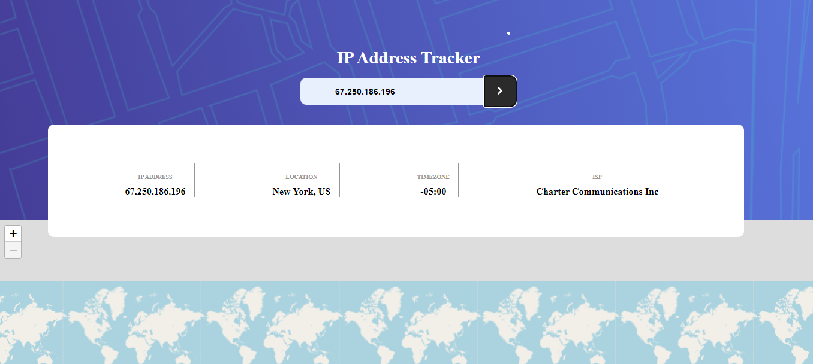
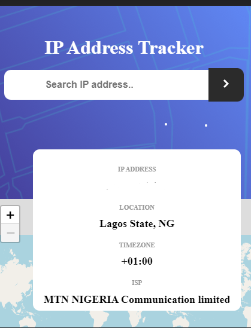

# Frontend Mentor - IP address tracker solution

This is a solution to the [IP address tracker challenge on Frontend Mentor](https://www.frontendmentor.io/challenges/ip-address-tracker-I8-0yYAH0). Frontend Mentor challenges help you improve your coding skills by building realistic projects. 

## Table of contents

  - [Overview](#overview)
  - [The challenge](#the-challenge)
  - [Screenshot](#screenshot)
  - [Links](#links)
  - [My process](#my-process)
  - [Built with](#built-with)
  - [What I learned](#what-i-learned)
  - [Continued development](#continued-development)
  - [Useful resources](#useful-resources)


## Overview
The challenge is to build a web tool that take in an IP and get it Location, ISP, Region, Country, timezone and it latitude and longitude to display it address on map. By default it gets the device's IP address. 

### The challenge

Users should be able to:

- View the optimal layout for each page depending on their device's screen size
- See hover states for all interactive elements on the page
- See their own IP address on the map on the initial page load
- Search for any IP addresses or domains and see the key information and location

### Screenshot

;
;


### Links

- Solution URL: [ solution URL](https://github.com/Davidmide02/Ip-Addrees-tracker.git)
- Live Site URL: [live site URL](https://davidmide02-ip-address-tracker.netlify.app/)

## My process
- A proper analysis of the UI for better and responsive styling
- Set the HTML file
- Set the CSS file
- JavaScript file
- Defination of functions needed 

### Built with

- Semantic HTML5 markup
- CSS custom properties
- Flexbox
- CSS Grid
- Mobile-first workflow
- [Leaflet.js](https://Leafletjs.org/) - JS library


### What I learned

- I learnt a new JavaScript Library, Leaflet.js
- Using API key
- How to incorporate map into your file

```html
<h1>Some HTML code I'm proud of</h1>


```js

let map = L.map([lat,lon],zoom level);
map.setVeiw()
```


### Continued development

- Style it using styling frameworks


### Useful resources

- [Youtube](https://youtube.com) 
- [Documentation]

## Author

- Website - [Add your name here](https://www.your-site.com)
- Frontend Mentor - [@Davidmide02](https://www.frontendmentor.io/profile/Davidmdie02)
- Twitter - [@Davidmide02](https://www.twitter.com/Davidmide02)


